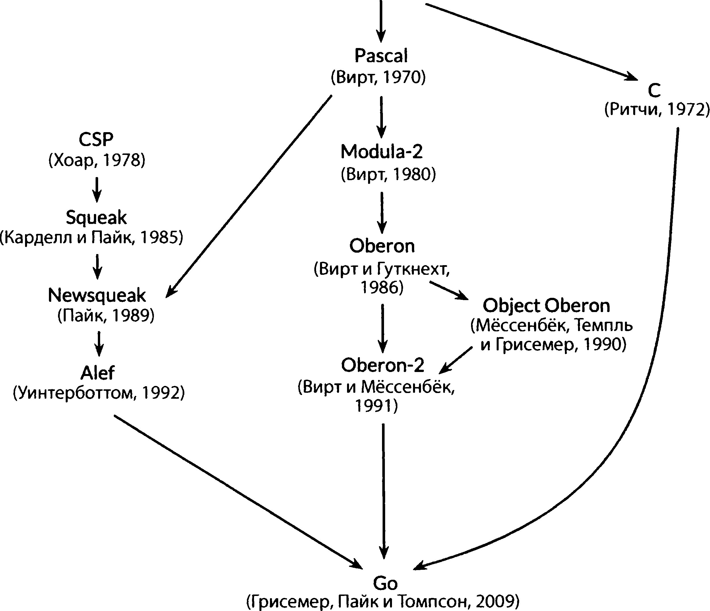

# Язык программирования Go
# Введение
Go был задуман в 2007 году сотрудниками Google. Анонс состоялся в 2009. Целью создания была задача создания выразительного, эфффективного и надежного в эксплуатации языка. Имеет сходство с C однако он вобрал в себя множество подходов и из других языков. Акцент сделан на парраллелизм.


### Является
- Является компилируемым
- Имеет автоматический "сборщик мусора"
- Программы не завершаются "аварийно"
- Мультиплатформенный, переносимый
- Система пакетов
- Лексическая область видимости
- Функции
- Интерфейс системных вызовов
- Поддерживает параллелизм "из коробки"
- "Все включено" - API ввода/вывода, текст, графика, криптография, сеть, распределенные вычисления

### Отсутствует
- Неявные числовые преобразования
- Конструкторы, деструкторы
- Перегрузка операторов
- Параметров по умолчанию
- Наследование
- Обобщенные типы

Все примеры кода могут быть загружены и выполнены прямо из репозитория

```bash
$ export GOPATH=$HOME/gobook # каталог рабочего пространства
$ go get site.com/path/project # выборка из репозитория
$ $GOPATH/bin/project # Запуск файла
Hello World
```

- Проверить наличие языка в системе

```bash
go version
```

### Первая программа на GO

```go

package main

import "fmt"

func main() {
	fmt.Println("Hello, мир")
}

```

Для запуска программы достаточно набрать `go run helloworld.go`

- Компилирует исходный код программы, связывает с библиотеками а затем выполняет полученный файл.
- Если программа предназначена более чем для разового запуска, то ее можно скомпилировать для, дальнейшего запуска. `go build helloworld.go` в этом случае создается бинарный выполняемый файл который можно запустить в любой момент времени без предварительной обработки.

```bach
$ ./helloworld.exe
Hello, мир

```

### Организация кода в GO

- Код организован в виде пакетов - содержимое каталога
- Каждый исходный файл начинается с объявления `package`, которое указывает к какому пакету относится данный файл
- Затем следует список импортируемых пакетов
- После этого сам код

В случае файла 'helloworld.go' импортированный пакет fmt стандартной библиотеки содержит функции для форматированного вывода и сканирования ввода.

- `main` - пакет определяющий отдельную программу, т.е выполнимый файл а не библиотеку. С функции `main()` начинается программа.
- Программа не будет компилировать как при отсутствии нужного пакета так и при наличии излишнего. `import` должно следовать за `package`

Символы новой строки преобразуются в точку с запятой, поэтому Go не требует указания этого символа. Но управляющая фигурная скобка должна в этом случае находиться в той же строке что и конец обьявления действия. Так же в выражении `x+y`символ новой строки разрешен после, но не до оператора +

`gofmt` и `go fmt` - команды для приведения кода к стандартному формату.


### Передача аргументов программе
- Через коммандную строку `os.Args`
	- _см. пример:_ `cli`
	- представлен в виде среза (slice)
	- доступ к элементам по индексу os.Args[i]
	- возможно указывать диапазоны os.Args[m:n]
	- первый элемент os.Args[0] - имя команды
	- получить все элементы os.Args[1:len(os.Args)]
	- если `m` или `n` опущены, используются значения по умолчанию 0 или `len(s)` =>получить все элементы os.Args[1:]

	```go
	func main() {
		var s, sep string
		for i := 1; i < len(os.Args); i++ {
			s += sep + os.Args[i]
			sep = " "
		}
		fmt.Println(s)
	}
	```
	-  значение индекса мы заменяем специальным символом (пустым идентификатором - `_`)
	- присваивание Go - `:=`  служит для обьявления и инициализации переменной значением литерала.

	```go
	func main() {
		s, sep := "", ""
		for _, arg := range os.Args[1:] {
			s += sep + arg
			sep = " "
		}
		fmt.Println(s)
	}
	```

- Мы можем объявить переменные несколькими путями
	- `s :=""` - допустимо применять только внутри функций
	- `var s string` - инициализация по умолчанию
	- `s = ""`
	- `var s string ""` - применяется когда тип переменной и инициализатора разные

- менее ресурсозатратная операция

```go
func main() {
	fmt.Println(strings.Join(os.Args[1:0]," "))
}
```

- форматирование по умолчанию

```go
fmt.Println(os.Args[1:0])
```

### Больше примеров


- `Dub` - выаодит текст каждой строки, которая появляется в стандартном выводе более одного раза, а так же количество ее появлений

```go

import (
	"bufio"
	"fmt"
	"os"
)

func main() {
	counts := make(map[string]int)
	input := bufio.NewScanner(os.Stdin)
	for input.Scan() {
		counts[input.Text()]++
	}
	// Примечание: игнорируем потенциальные ошибки из input.Err()
	for line, n := range counts {
		if n > 1 {
			fmt.Printf("%d\t%s\n", n, line)
		}
	}
}

```

- `отображение (map)` - содержит набор пар "ключ-значение", в данном случае ключем является строка, а значением целочисленное значение
- функция `make` создает пустое отображение
- когда считываеся строка ввода эта строка используется как ключ, а значение увеличивается `counts[input.Text()]++` соответствует

	```go
	line := input.Text()
	counts[line] = counts[line] + 1
	```

- пакет `bufio` - позволяет работать с системой ввода/вывода, Scanner считывает стандартный ввод программы. `input.Scan()` - считывает очередную строку
- `fmt.Printf`  позволяет форматировать вывод с помошью модификаторов

| маска    | описание 							  |
|----------|--------------------------|
|  %d      | Десятично целое          |
| %x,%o,%e | Целое 16-, 8-, 2- ичное  |
| %f,%g,%e | Числа с плавающей точкой |
| %t       | Булево                   |
| %с       | Руна                     |
| %s       | Строка                   |
| %q       | Вывод в кавычках строки  |
| %v       | Без форматирования       |
| %T       | Любое значение           |
| %%       | Процент                  |

- модифицируем программу для считывания данных из файлов, которые мы передаем в аргументах

```go
func main() {
	counts := make(map[string]int)
	files := os.Args[1:]
	if len(files) == 0 {
		countLines(os.Stdin, counts)
	} else {
		for _, arg := range files {
			f, err := os.Open(arg)
			if err != nil {
				fmt.Fprintf(os.Stderr, "dub2: %v\n", err)
				continue
			}
			countLines(f, counts)
			f.Close()
		}
	}
	for line, n := range counts {
		if n > 1 {
			fmt.Printf("%d\t%s\n", n, line)
		}
	}
}

func countLines(f *os.File, counts map[string]int) {
	input := bufio.NewScanner(f)
	for input.Scan() {
		counts[input.Text()]++
	}
}
```

- `os.Open` - возвращает 2 значения, первое является открытым файлом, второе ошибкой
- отображение `counts` является ссылкой на структуру, поэтому все изменения внутри функции, будут видны во внешней области, где она объявлена.
- данная реализация работает в "потоковом режиме"

```go

import (
	"fmt"
	"io/ioutil"
	"os"
	"strings"
)

func main() {
	counts := make(map[string]int)
	for _, filename := range os.Args[1:] {
		data, err := ioutil.ReadFile(filename)
		if err != nil {
			fmt.Fprintf(os.Stderr, "dub3: %v\n", err)
			continue
		}
		for _, line := range strings.Split(string(data), "\n") {
			counts[line]++
		}
	}
	for line, n := range counts {
		if n > 1 {
			fmt.Printf("%d\t%s\n", n, line)
		}
	}
}

```

- `ReadFile` - считывает все содержимое файла целиком
- `Strings.Split` - разбивает строку на срез

### Работа с графикой

```go

import (
	"image"
	"image/color"
	"image/gif"
	"io"
	"math"
	"math/rand"
	"os"
)

import (
	"time"
)

//!+main

var palette = []color.Color{color.White, color.Black}

const (
	whiteIndex = 0 // Первый цвет палитры
	blackIndex = 1 // Следующий цвет палитры
)

func main() {
	//!-main
	// Последовательность изображений является детерминированной,
	// если мы не используем случайное зерно
	// Генератор псевдослучайных чисел с использованием текущего времени.
	rand.Seed(time.Now().UTC().UnixNano())
	lissajous(os.Stdout)
}

func lissajous(out io.Writer) {
	const (
		cycles  = 5     // количество колебаний
		res     = 0.001 // Угловое разрашение
		size    = 100   // Размер изображения [-size..+size]
		nframes = 64    // Количество кадров анимации
		delay   = 8     // Задержка между кадрами
	)
	freq := rand.Float64() * 3.0 // Относительная частота колебаний
	anim := gif.GIF{LoopCount: nframes}
	phase := 0.0 // разность фаз
	for i := 0; i < nframes; i++ {
		rect := image.Rect(0, 0, 2*size+1, 2*size+1)
		img := image.NewPaletted(rect, palette)
		for t := 0.0; t < cycles*2*math.Pi; t += res {
			x := math.Sin(t)
			y := math.Sin(t*freq + phase)
			img.SetColorIndex(size+int(x*size+0.5), size+int(y*size+0.5),
				blackIndex)
		}
		phase += 0.1
		anim.Delay = append(anim.Delay, delay)
		anim.Image = append(anim.Image, img)
	}
	gif.EncodeAll(out, &anim) // NOTE: ignoring encoding errors
}
```

- Собираем приложение `go build ./gif.go`
- Формируем изображение `./gif.exe > img.gif`

### Работа с сетью

- программа, которая извлекает запрос сайта, и возвращает содержимое.

```go

import (
	"fmt"
	"io/ioutil"
	"net/http"
	"os"
)

func main() {
	for _, url := range os.Args[1:] {
		resp, err := http.Get(url)
		if err != nil {
			fmt.Fprintf(os.Stderr, "fetch: %v\n", err)
			os.Exit(1)
		}
		b, err := ioutil.ReadAll(resp.Body)
		resp.Body.Close()
		if err != nil {
			fmt.Fprintf(os.Stderr, "fetch: reading %s: %v\n", url, err)
			os.Exit(1)
		}
		fmt.Printf("%s", b)
	}
}

```

- запрос `./getRequest.exe https://www.vk.com`

### Параллелизм GO

- Программа принимает множество http запросов и запускает выборку параллельно. Вместо тела возвращает время выборки каждого из запросов и размер ответа

```go
import (
	"fmt"
	"io"
	"io/ioutil"
	"net/http"
	"os"
	"time"
)

func main() {
	start := time.Now()
	ch := make(chan string) // создать канал строк
	for _, url := range os.Args[1:] {
		go fetch(url, ch) // старт go-рутину
	}
	for range os.Args[1:] {
		fmt.Println(<-ch) // принять данные от канала ch
	}
	fmt.Printf("%.2fs elapsed\n", time.Since(start).Seconds())
}

func fetch(url string, ch chan<- string) {
	start := time.Now()
	resp, err := http.Get(url)
	if err != nil {
		ch <- fmt.Sprint(err) // отправить данные в канал
		return
	}

	nbytes, err := io.Copy(ioutil.Discard, resp.Body)
	resp.Body.Close() //не занимать ресурс
	if err != nil {
		ch <- fmt.Sprintf("while reading %s: %v", url, err)
		return
	}
	secs := time.Since(start).Seconds()
	ch <- fmt.Sprintf("%.2fs  %7d  %s", secs, nbytes, url)
}
```

- Пример работы

```bash
 $ go build getManyRequests.go
 $ ./getManyRequests.exe https://golang.org http://gopl.io https://godoc.org

0.44s     7902  https://golang.org
0.46s     6859  https://godoc.org
0.87s     4154  http://gopl.io
0.87s elapsed
```

### Веб-сервер

**Простейший пример**

```go
package main

import (
	"fmt"
	"log"
	"net/http"
)

func main() {
	http.HandleFunc("/", handler) // каждый запрос вызывает функцию
	log.Fatal(http.ListenAndServe("localhost:8000", nil))
}

// функция выводит путь запроса без параметров
func handler(w http.ResponseWriter, r *http.Request) {
	fmt.Fprintf(w, "URL.Path = %q\n", r.URL.Path)
}
```

- `http.HandleFunc` - обработчик запросов
- `http.Request` - поля запроса
- `fmt.Fprintf` - отправляет ответ обратно


 **Co счетчиком запросов**

```go
import (
	"fmt"
	"log"
	"net/http"
	"sync"
)

// для избежания "гонки" за ресурс
var mu sync.Mutex
var count int

func main() {
	http.HandleFunc("/", handler)
	http.HandleFunc("/count", counter)
	log.Fatal(http.ListenAndServe("localhost:8000", nil))
}

// Выводит компонент пути пользовательского запроса
func handler(w http.ResponseWriter, r *http.Request) {

	// блокируем доступ к переменной
	mu.Lock()
	count++
	mu.Unlock()
	fmt.Fprintf(w, "URL.Path = %q\n", r.URL.Path)
}

// вывести количество запросов
func counter(w http.ResponseWriter, r *http.Request) {
	mu.Lock()
	fmt.Fprintf(w, "Count %d\n", count)
	mu.Unlock()
}
```

- *более детальный вывод*

```go
func handler(w http.ResponseWriter, r *http.Request) {
	fmt.Fprintf(w, "%s %s %s\n", r.Method, r.URL, r.Proto)
	for k, v := range r.Header {
		fmt.Fprintf(w, "Header[%q] = %q\n", k, v)
	}
	fmt.Fprintf(w, "Host = %q\n", r.Host)
	fmt.Fprintf(w, "RemoteAddr = %q\n", r.RemoteAddr)
	if err := r.ParseForm(); err != nil {
		log.Print(err)
	}
	for k, v := range r.Form {
		fmt.Fprintf(w, "Form[%q] = %q\n", k, v)
	}
}
```


```bash

GET /dfghjk?dfgf=[ewrt],[fghj]&vbn=3 HTTP/1.1
Header["Connection"] = ["keep-alive"]
Header["Upgrade-Insecure-Requests"] = ["1"]
Header["Accept"] = ["text/html,application/xhtml+xml,application/xml;q=0.9,image/webp,image/apng,*/*;q=0.8"]
Header["Accept-Encoding"] = ["gzip, deflate, br"]
Header["Accept-Language"] = ["ru-RU,ru;q=0.8,en-US;q=0.6,en;q=0.4,de;q=0.2"]
Header["Cookie"] = ["_ga=GA1.1.480143987.1492853341"]
Header["User-Agent"] = ["Mozilla/5.0 (Windows NT 10.0; Win64; x64) AppleWebKit/537.36 (KHTML, like Gecko) Chrome/59.0.3071.115 Safari/537.36"]
Host = "localhost:8000"
RemoteAddr = "127.0.0.1:64812"
Form["dfgf"] = ["[ewrt],[fghj]"]
Form["vbn"] = ["3"]

```

### Механизм интерфейсов

- программа `get_request` и `gif` - копирует ответ HTTP в `os.Stdout`
- программа `get_many_requests` - копирует ответ в `ioutil.Discard`
- программы `server` иапользуют `fmt.Printf` для записи `http.ResponseWriter` который являетвя предтавлением веб-браузера.

Все эти программы удовлетворяют общему интерфейсу - `io.Writer`

Легко вывести gif изображение прямо в браузер.

```go
handler :=func(w http.ResponceWriter, r *http.Request) {
	lissajous(w)
}

http.HandleFunc("/", handler)
```
